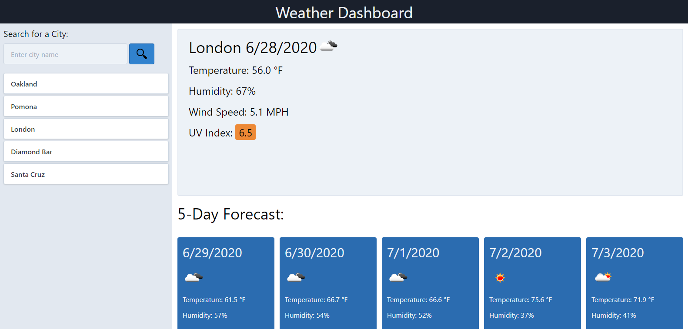

# Weather Dashboard

## Purpose
A website that when prompted in a search bar, displays weather related information for the current day, and a 5 day forecast. A search history bar also lets the user click on previously searched cities to display that cities weather information. The search history bar is persistent and stays in local storage for the user to have even when the site is revisisted.
## Built with
* HTML
* CSS
* JavaScript
* Web APIs
    * Open Weather Map API
    * Tailwind CSS packet
## Website
https://scotitakura.github.io/weather-dashboard/
## Contributions
* Scot Itakura